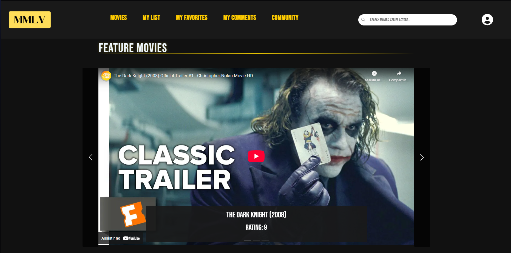
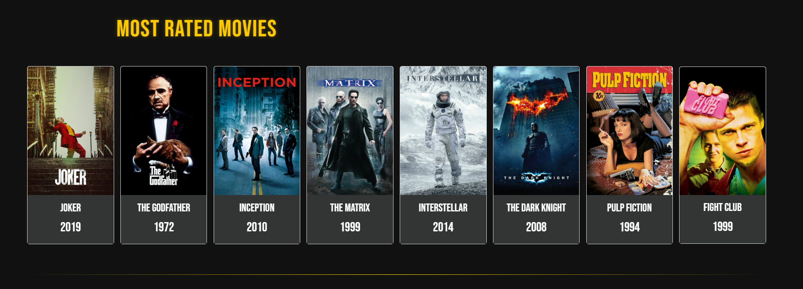
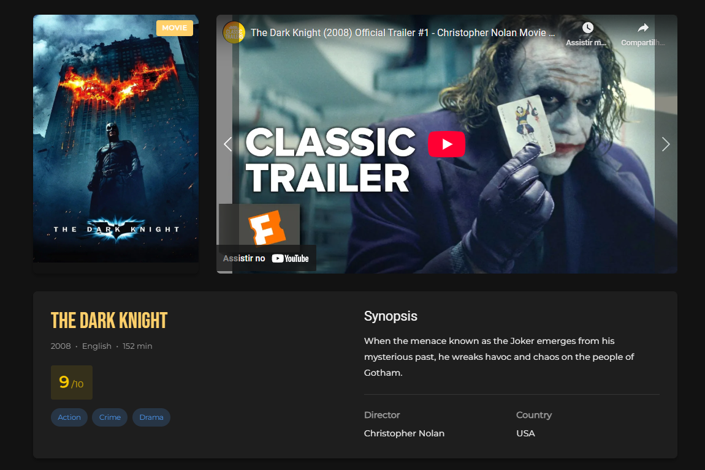

# 🎬 My Movie List

Aplicação web interativa para **explorar, visualizar e gerenciar uma lista de filmes e séries**, com foco em experiência do usuário, design responsivo e organização de conteúdo multimídia.

# 📸 Preview  
### Home Page

### Tela de Detalhes

## 🧩 Funcionalidades

- Página inicial com carrossel de destaques aleatórios
- Exibição de pôsteres de filmes e séries em cards
- Página de detalhes com:
  - Trailer incorporado
  - Galeria de imagens
  - Gêneros destacados
  - Informações completas: título, sinopse, nota, duração/temporadas, país, idioma, diretor ou criador
- Diferenciação visual entre filmes e séries
- Busca baseada no `id` via parâmetros de URL
- Dados carregados dinamicamente via JSON

## 💡 Tecnologias Utilizadas

- HTML5
- CSS3
- JavaScript (puro)
- Bootstrap 5
- JSON externo com `fetch()`

## 🧑‍💻 Autor

- **Arthur Henrique Tristão Pinto**  
- Estudante de Ciência da Computação na PUC Minas  
- Desenvolvedor focado em interfaces intuitivas e projetos web funcionais

## 📬 Contatos

- 📧 [arthurhtp20@gmail.com](mailto:arthurhtp20@gmail.com)  
- 🔗 [LinkedIn](https://www.linkedin.com/in/arthurhtp)
